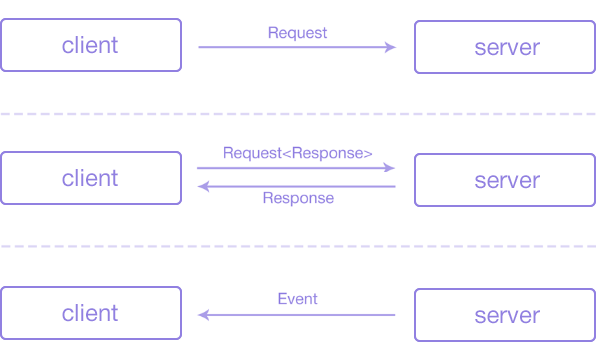

# Networking Basics

This section explains Fenrir networking model.

Previous Section: [Quick Start](QuickStart.md)

Fenrir Multiplayer uses basic messaging primitives: **Requests**, **Responses**, and **Events**.



**Request**
Very much like HTTP, requests are sent from the client to a server. **Request** can optionally have a **Response**.
Requests usually represent an action that client wants server to perform. For example, invoke a specific server method (similar to RPC), or update a client-authoritative state.
Another example, is request to send someone a chat message.

**Response**
Response is always sent from server to client. Response objects always have a request that triggered them, but not every requests require a response.
For example, response might contain information about successful (or unsuccessful) chat message delivery.

**Event**
Events are messages asynchoronously sent from a server to a client. 
Events usually update client state asynchronously when client might or might not expect. For example, they may represent an incoming chat message.

## Request and Event Handlers

Fenrir provides a strictly typed mechanism of defining messages such as Request, Responses and Events. This means that Requests, Responses and Events are defined as C# classes.
Messages only represent data sent over the wire. In other words, they are **Data Transfer Objects**.
It is programmers job to define how Requests are handled by the server (and Events are handled by the client).

In order to do that, you can define a Request Handler or Event Handler.

### Example Request

**Example Request** (client+server shared code):

```csharp
using Fenrir.Multiplayer;

class HelloRequest : IRequest, IByteStreamSerializable
{
    public string Name;

    // You can read about message Serialization in the next section

    public void Serialize(IByteStreamWriter writer)
    {
        writer.Write(Name);
    }

    public void Deserialize(IByteStreamReader reader)
    {
        Name = reader.ReadString();
    }
}
```

**Example server Request handler** (server code)

```csharp
using Fenrir.Multiplayer;

// Request Handler
class HelloRequestHandler : IRequestHandler<HelloRequest>
{
    public void HandleRequest(HelloRequest request, IServerPeer peer)
    {
        Console.WriteLine("Hello, " + request.Name); // prints: "Hello, World"
    }
}

...

// Server initialization
using var networkServer = new NetworkServer(); // Default BindPort is 27016
networkServer.AddRequestHandler<HelloRequest>(new HelloRequestHandler());
networkServer.Start();
```

**Example client sending a Request** (client code):

```csharp
using Fenrir.Multiplayer;

using var networkClient = new NetworkClient();
var connectionResponse = await networkClient.Connect("http://127.0.0.1:27016");

// Send request
networkClient.Peer.SendRequest(new HelloRequest() { Name = "World" });

// Server prints "Hello, World"
```

### Example Request with Response

**Example Request with Response** (client+server shared code):

```csharp
using Fenrir.Multiplayer;

class PingResponse : IResponse, IByteStreamSerializable
{
    public string ResponseText;

    public void Deserialize(IByteStreamReader reader)
    {
        ResponseText = reader.ReadString();
    }

    public void Serialize(IByteStreamWriter writer)
    {
        writer.Write(ResponseText);
    }
}

class PingRequest : IRequest<PingResponse>, IByteStreamSerializable
{
    public string Name;

    public void Serialize(IByteStreamWriter writer)
    {
        writer.Write(Name);
    }

    public void Deserialize(IByteStreamReader reader)
    {
        Name = reader.ReadString();
    }
}
```

**Example server Request handler with Response** (server code):

```csharp
using Fenrir.Multiplayer;

// Request Handler
class PingRequestHandler : IRequestHandler<PingRequest, PingResponse>
{
    public PingResponse HandleRequest(PingRequest request, IServerPeer peer)
    {
        return new PingResponse(){ ResponseText = "Hello, " + request.Name };
    }
}

...

// Server initialization
using var networkServer = new NetworkServer(); // Default BindPort is 27016
networkServer.AddRequestHandler<PingRequest, PingResponse>(new PingRequestHandler());
networkServer.Start();
```

**Example client sending a Request with a Response** (client code):

```csharp
using Fenrir.Multiplayer;

using var networkClient = new NetworkClient();
await networkClient.Connect("http://127.0.0.1:27016");

// Send request
var response = await networkClient.Peer.SendRequest<PingRequest, PingResponse>(new PingRequest() { Name = "World" });
Debug.Log(response.ResponseText); // prints "Hello, World"
```

### Example Event

**Example Event** (client+server shared code):

```csharp
using Fenrir.Multiplayer;

class PingEvent : IEvent, IByteStreamSerializable
{
    public string Name;

    public void Serialize(IByteStreamWriter writer)
    {
        writer.Write(Name);
    }

    public void Deserialize(IByteStreamReader reader)
    {
        Name = reader.ReadString();
    }
}
```

**Example server sending Event** (server code):

```csharp
using Fenrir.Multiplayer;

using var networkServer = new NetworkServer();
networkServer.PeerConnected += (sender, e) =>
{
    // When new peer connects, send them an event
    e.Peer.SendEvent(new TestEvent() { Value = "Mr.Server" });
};
networkServer.Start();
```

**Example client Event Handler** (client code):

```csharp
using Fenrir.Multiplayer;

class PingEventHandler : IEventHandler<PingEvent>
{
    public void OnReceiveEvent(PingEvent evt)
    {
        Debug.Log("Hello from " + evt.Name);
    }
}

...

// Client initialization
using var networkClient = new NetworkClient();
networkClient.AddEventHandler<PingEvent>(new PingEventHandler());
await networkClient.Connect("http://127.0.0.1:27016");
// After a successful connection, client prints "Hello from Mr.Server"
```

Next Section: [Connection](Connection.md)
Table of Contents: [Documentation Home](DocumentationIndex.md)
